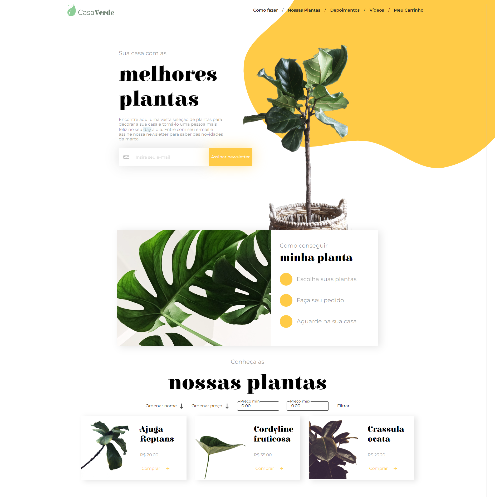

<h1 align="center">Casa Verde</h1>


Casa Verde simula um pequeno site de E-commerce
<br />
O site recebe os produtos de uma "API"
e tem funcionalidades como filtro, ordenar por, envio de email para o usuário, entre outros

<div align="center">
  
</div>

## 📁 Acesso
É possivel baixar o projeto nesse <a href="https://github.com/lucash-barbosa/Casa-Verde/archive/refs/heads/master.zip">link</a>
ou acessar o <a href="https://casa-verde-tau.vercel.app">site</a>

## 🛠️ Abrir e rodar o projeto

```bash
npm install
npm start

# Abra o programa no navegador pelo link http://localhost:3000/
```
